<picture>
  <source media="(prefers-color-scheme: dark)" srcset="assets/hero.svg">
  
</picture>

  &nbsp;&nbsp;
  &nbsp;&nbsp;
  &nbsp;&nbsp;
  &nbsp;&nbsp;
  

 

## About

I keep infrastructure running so teams can ship without surprises. **Kubernetes**, **CI/CD**, **GitOps**, and **observability** are my bread and butter—building reliable delivery pipelines, container platforms, and monitoring that surfaces problems before they become incidents.

Active open source contributor across cloud-native infrastructure, distributed systems, CI/CD, observability, databases, and AI infrastructure. Projects include `helm/helm`, `moby/moby`, `prometheus/prometheus`, `cockroachdb/cockroach`, `argoproj/argo-cd`, `grafana/grafana`, and more.

Microsoft Certified (AI-900, AZ-900, SC-900) &bull; GitHub Foundations. Currently exploring GenAI infrastructure and autonomous DevOps.

> `npx lohitkolluri` for the quick version.

 

## Tech Stack

  
  
  
  
  
  
  

 
<picture>
  <source media="(prefers-color-scheme: dark)" srcset="assets/divider.svg">
  
</picture>
 

<picture>
  <source media="(prefers-color-scheme: dark)" srcset="assets/stats.svg">
  
</picture>

 
<picture>
  <source media="(prefers-color-scheme: dark)" srcset="assets/divider.svg">
  
</picture>
 

## Open Source Contributions

<table>
  <thead>
    <tr>
      <th>Project</th>
      <th>Contribution</th>
      <th>PR</th>
    </tr>
  </thead>
  <tbody>
  </tbody>
    <tr>
      <td>&nbsp; Docker / Moby</td>
      <td>Fix Swarm constraint scheduling for completed job tasks</td>
      <td align="center"><a href="https://github.com/moby/moby/pull/52786"><code>#52786</code></a></td>
    </tr>
    <tr>
      <td>&nbsp; SwarmKit</td>
      <td>Correct resource reservation accounting for completed job tasks</td>
      <td align="center"><a href="https://github.com/moby/swarmkit/pull/3237"><code>#3237</code></a></td>
    </tr>
    <tr>
      <td>&nbsp; Helm</td>
      <td>Enable reproducible chart archives via <code>SOURCE_DATE_EPOCH</code></td>
      <td align="center"><a href="https://github.com/helm/helm/pull/32162"><code>#32162</code></a></td>
    </tr>
    <tr>
      <td>&nbsp; Prometheus</td>
      <td>Improve AWS service discovery initialization and TSDB retention documentation</td>
      <td align="center">
        <a href="https://github.com/prometheus/prometheus/pull/19037"><code>#19037</code></a>
        <a href="https://github.com/prometheus/prometheus/pull/18996"><code>#18996</code></a>
      </td>
    </tr>
    <tr>
      <td>&nbsp; Prometheus Operator</td>
      <td>Strengthen validation, documentation, linting, and test coverage</td>
      <td align="center">
        <a href="https://github.com/prometheus-operator/prometheus-operator/pull/8587"><code>#8587</code></a>
        <a href="https://github.com/prometheus-operator/prometheus-operator/pull/8589"><code>#8589</code></a>
        <a href="https://github.com/prometheus-operator/prometheus-operator/pull/8591"><code>#8591</code></a>
        <a href="https://github.com/prometheus-operator/prometheus-operator/pull/8592"><code>#8592</code></a>
        <a href="https://github.com/prometheus-operator/prometheus-operator/pull/8595"><code>#8595</code></a>
      </td>
    </tr>
    <tr>
      <td>&nbsp; CockroachDB</td>
      <td>Improve SQL optimizer testing with metamorphic defaults</td>
      <td align="center"><a href="https://github.com/cockroachdb/cockroach/pull/170882"><code>#170882</code></a></td>
    </tr>
    <tr>
      <td>&nbsp; Apache Airflow</td>
      <td>Improve API reliability during SQLite lock contention</td>
      <td align="center"><a href="https://github.com/apache/airflow/pull/67900"><code>#67900</code></a></td>
    </tr>
    <tr>
      <td>&nbsp; Jenkins</td>
      <td>Improve workspace response encoding and credential error handling</td>
      <td align="center">
        <a href="https://github.com/jenkinsci/jenkins/pull/26912"><code>#26912</code></a>
        <a href="https://github.com/jenkinsci/credentials-plugin/pull/1060"><code>#1060</code></a>
      </td>
    </tr>
    <tr>
      <td>&nbsp; Docker Model Runner</td>
      <td>Extend CUDA build support for Pascal-generation NVIDIA GPUs</td>
      <td align="center"><a href="https://github.com/docker/model-runner/pull/986"><code>#986</code></a></td>
    </tr>
    <tr>
      <td>&nbsp; Argo CD</td>
      <td>Accelerate test execution through parallelized unit tests</td>
      <td align="center"><a href="https://github.com/argoproj/argo-cd/pull/28177"><code>#28177</code></a></td>
    </tr>
    <tr>
      <td>&nbsp; Grafana</td>
      <td>Prevent modal border color bleeding across themes</td>
      <td align="center"><a href="https://github.com/grafana/grafana/pull/125797"><code>#125797</code></a></td>
    </tr>
  </tbody>
</table>

 

## Badges &amp; Recognition

  

 
<picture>
  <source media="(prefers-color-scheme: dark)" srcset="assets/divider.svg">
  
</picture>
 

  <i>Let's connect and build something awesome together.</i>
    
  

